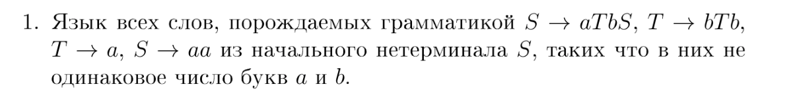
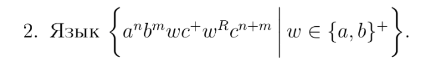
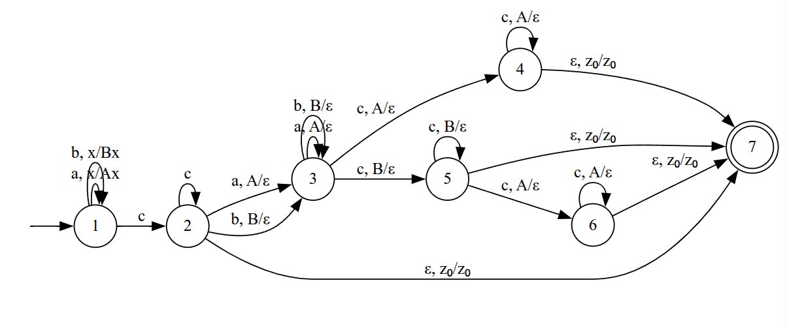
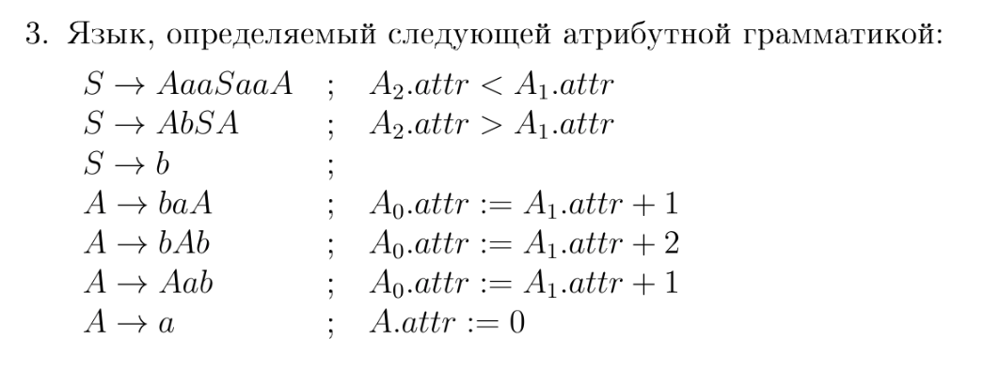

# Задача 1

Это язык 
$$L = \{(ab^{s_1}ab^{s_1+1})(ab^{s_2}ab^{s_2+1})\cdots(ab^{s_n}ab^{s_n+1})aa, s_i \geq 0, n \geq 0, |w_a| \neq |w_b| \}$$

Накачаем $$w = ab^pab^pb(aab)^{2p! + 2p - 3}aa = ab^pab^{p + 1}(aab)^{2p! + 2p - 3} aa$$

Длина накачки p.
По лемме Огдена выделим все центральные b их как раз $\geq p$.

$$w = wvxyz$$

Случай 1: $vxy$ лежит в $b^{p}ab^{p+1}$

Если $v$ или $y$ содержат a, то нулевой накачкой потеряем структуру слова, поэтому рассмотрим, что если $vxy$ лежит целиком во втором блоке из b: при отрицательной накачке потеряется вид $b^xab^{x+1}$ и мы выйдем из языка.

Если на стыке $b^pab^p$ (причем чтобы сохранилась структура надо одинаковые длины в обоих блоках):
$$w' = ab^{p + in}ab^{p + in} b (aab)^{2p! + 2p - 3}aa$$

$$|w|_a = 4 + 4p! + 4p - 6 = 4p! + 4p - 2$$
$$|w|_b = 2p + 2in + 1 + 2p! + 2p - 3 = 2p! + 4p + 2in - 2$$

Чтобы стало $|w|_a = |w|_b$ нужно чтобы:
$$p! = in$$
Так как $i < p$, то $i | p!$ и такое n всегда найдется, так что слово выйдет из языка.

Случай 2: $vxy$ лежит на стыке $b^{p+1}(aab)^{2p! + 2p - 3}$

Хотя бы одна центральная b должна войти либо в $v$ либо в $y$, но тогда отрицательной накачкой структура $ab^xab^{x+1}$ снова теряется.
 

# Задача 2

Язык DCFL, его DPDA:

Язык не $LL(k)$, для кадого $k$ есть слова:

$$a^kbcbc^{k}$$

$$a^kacac^{k}$$

по первым k символам нельзя детерминировано перейти в новое состояние.

# Задача 3

Заметим, что атрибут A хранит число букв b, им порожденных. 

 

Для накачки возьмем пересечение языка с $b^+ab^+ab^+ab^+$ и в нем слово:
$$w = b^nab^n b \underline{b}b^n a bab^n = uvxyz,  |vxy| < n$$

Назовем b, в которую терминировала S терминальной, и заметим что в нашем слове оно может быть только в указанном блоке, потому что слева и справа должно быть хотя бы по одной букве a (терминальная для A).

Любые разбиения где в $v/y$ входит a мы не рассматриваем, потому что они нулевой накачкой выводятся из языка.

>Как из A можно получить блок $b^{s_1}ab^{s_2}ab^{s_3}:$
 
Заметим что правило $A \to bAb$ не порождает новых букв a, и в A минимум одна a - терминальная, то есть для создания такого блока нужно только один раз применить правило, порождающее букву a.
Применяя $A \to Aab$ или $A \to baA$ мы забываем о хвосте, так что сначала надо применять правило $A \to bAb$, например получим $b^sAb^s$ и на этом ходе применяем любое другое правило (два случая симметричны) получаем $b^sAab^{s+1}$ чтобы получить подблок $ab^x$ нам остается использовать только правило $A \to bAb$ до терминирования, так что получится строка 
$$b^sb^xab^xab^{s+1}$$
или
$$b^{s+1}ab^xab^xb^{s}$$

Случаи для накачки:
1) **vxy полностью в одном из блоков $b^n$.** 

Если это первый блок, тогда, например при длине накачки, обеспечивающей вид нового слова:
$$w' = b^{n + k}ab^n b \underline{b} b^nabab^n = uvxyz, n + k > 5n$$
это выводит из языка, потому что не будет структуры $b^xab^{x+1}$ слева от терминальной b.

Если это второй блок, то 
$$w' = b^nab^nb\underline{b}b^{n+k}abab^n$$

По замечанию о виде строки $b^{s_1}ab^{s_2}ab^{s_3}$ справа от терминальной b возможны случаи:

$$n + k + 1 = n + 1 \Rightarrow k = 0$$

или

$$n + k + 1 = n \Rightarrow k = -1$$

Но оба варианта противоречат тому, что $|vy| > 0$

Если $vxy$ в блоке из одной b, то нулевой накачкой выводим из языка.

Если в последнем блоке, то 

$$w' = b^nab^nb\underline{b}b^{n}abab^{n+k}$$
Снова варианты:

$$n + 1 = n + k + 1 \Rightarrow k = 0$$

или

$$n + 1 = n + k + 1 \Rightarrow k = 0$$

Противоречие c $|vy| > 0$.

Если $vxy$ на границе $b^nab^n$:
$$w' = b^{n+i}ab^{2n+2+j} a bab^n$$

По наблюдению какого вида строки $b^{s_1}ab^{s_2}ab^{s_3}$ для последнего блока:
$b^xabab^n$ составим уравнения:
>$x = n + 1 - 1 \Rightarrow x = n$

>$x + 1 - 1 = n \Rightarrow x = n$

Система с одним решением $x=n$

Поэтому слово:
$$w' = b^{n+i}ab^{n+2+j} b^n a bab^n$$

Опять же терминальная b во втором блоке и 
$$w' = b^{n+i}ab^{n+i}b^{2+j -i} b^n a bab^n$$
Откуда так как терминальная b не соседствует с aa, то $j - i = 0$, так что качается:
$$w' = b^{n+i}ab^{n+i}b^{2} b^n a bab^n$$
и при $i > n + 1$ будет противоречие с тем что применялось правило для которого $A_2.attr > A_1.attr$.

Если $vxy$ в части $b^nab$:
$v \in b^n, y \in b$
Если y не пуст, то нулевой накачкой выводим из языка, если нулевой, то 
$$w' = b^nab^n b \underline{b}b^{n + i} a bab^n$$
В этой строке терминальная b привязана к своей позиции из за левой части. Как уже известно это строка:
$$w' = b^nab^n b \underline{b}b^ib^{n} a bab^n$$

То есть при $i \neq 0$ слово выводится из языка.Но $|vy| > 0$.

Если $vxy$ в части $bab^n$:

Аналогично прошлому случаю $v = \varepsilon$ (иначе отрицательная накачка), а терминальная b привязана к позиции:

$$w' = b^nab^n b \underline{b}b^n a bab^{n+i}$$

В этом случае при $i \neq 0$ слово выводится из языка. Но $|vy| > 0$.

Язык не КС.
