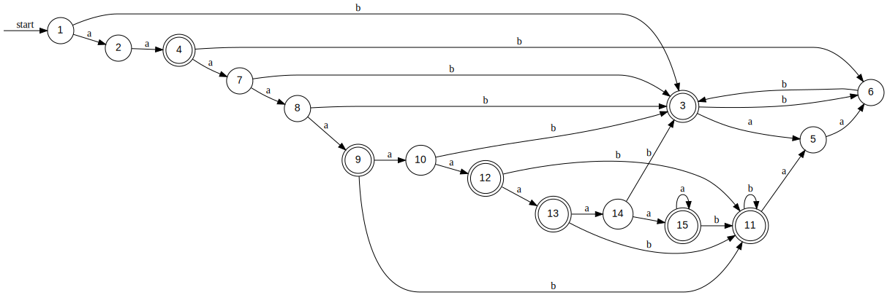
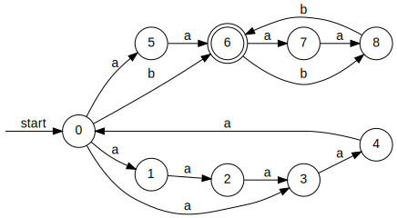

# Минимальный ДКА:

# НКА:

## Таблица НКА:
| State | $a^2$ | $a^6$ | $a^4$ | $a^3$ | $a$ | $\varepsilon$ |
|-------|-------|-------|-------|-------|-----|---------------|
| 0     | +     | -     | -     | -     | -   | -             |
| 1     | -     | +     | -     | -     | -   | -             |
| 3     | -     | -     | +     | -     | -   | -             |
| 4     | -     | -     | -     | +     | -   | -             |
| 5     | -     | -     | -     | -     | +   | -             |
| 6     | -     | -     | -     | -     | -   | +             |
| 2     | -     | -     | -     | -     | -   | -             |
| 7     | -     | -     | -     | -     | -   | -             |
| 8     | -     | -     | -     | -     | -   | -             |

То есть в НКА как минимум 5 состояний.
$$\mathcal{L}(2) \subset \mathcal{L}(0)$$
$$\mathcal{L}(8) \subset \mathcal{L}(0)$$
$$\mathcal{L}(7) \subset \mathcal{L}(4)$$
Состояния не получилось обьединить, автомат начинает принимать новые строки.

