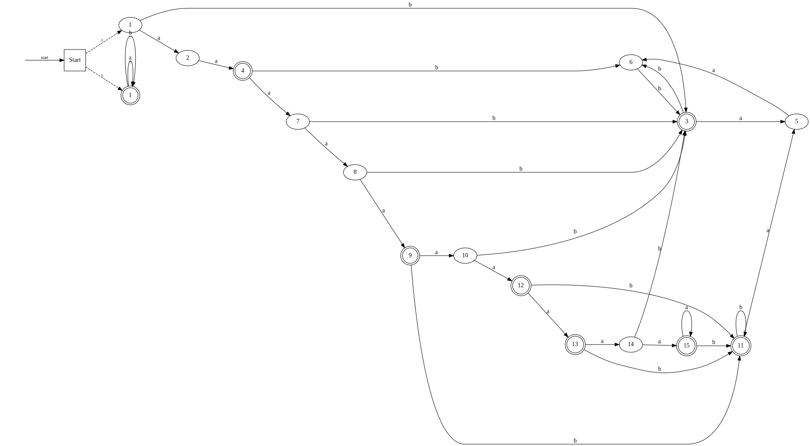

# Минимальный ДКА:

## Таблица ДКА:
| Состояние | $b$ | $aa$ | $a$ | $ab$ | $bba$ | $ba$ | $aaa$ | $abba$ | $a^4bba$ | $a^3bba$ | $a^2bba$ |
|----------|----|----|----|----|----|----|----|----|----|-----|-----|
|      1   |  +  |  +  | +   |  -  |  -  |  +  |   + |   - | -   | -    |  +   |
|      2   |  -  |  +  | +   |  +  | -   | -   | +   |   + | +   | -    |  -   |
|      3   |  +  |  +  |  +  |  +  | +   | -   |  -  |  -  |  -  |  -   |  -   |
|      4   |  +  | +   |+    | +   | +   | -   |  +  |  -  |  -  |  +   |  -   |
|      5   |  -  |  -  | +   | +   |  -  | -   | -   | -   |  -  |  -   |  -   |
|      6   |  +  | -   |   - | -   | -   | +   |  -  | -   |  -  | -    |   -  |
|      7   |  +  |  +  | +   | +   |  -  | +   |  +  |  -  | +   | -    |   +  |
|      8   | +   |  +  |  +  |  +  |  -  | +   |  +  |  +  |  +  |  +   |  -   |
|      9   | +   |   + | +   | +   | +   | +   |+    |  -  |  -  |  +   |  +   |
|      10  | +   |   + |   + |  +  |  -  | +   | +   |   + | +   |  -   |  +   |
|      11  |  +  | +   | +   |  -  |  +  |  +  | -   |  -  | -   | -    |  -   |
|      12  |  +  | +   | +   |  +  |  +  |  +  | +   |  +  | +   |+     | -    |
|      13  |  +  |  +  |  +  |  +  | +   |  +  |  +  |  -  | +   |  +   |  +   |
|      14  |  +  |  +  |  +  | +   | -   | +   |  +  |  +  | +   |  +   |  +   |
|      15  |  +  |  +  |  +  |   + | +   |   + |  +  | +   | +   |  +   |  +   |

# НКА:

## Таблица НКА:
| State | $a^2$ | $\varepsilon$ | $ab$ | $b$ | $a$ |      
|-------|-------|-------|-------|-------|-----|
| {0}($\varepsilon$)     | +     | -     | -     | +     | -   | 
| {5}(b)     | -     | +     | -     | -     | -   |
| {6}(ba)     | -     | -     | +     | -     | -   |
| {7}(bb)     | -     | -     | -     | +     | -   |
| {1, 3}(a)     | -     | -     | -     | -     | +   | 

То есть в НКА как минимум 5 состояний.

# Расширенное регулярное выражение:

`^(?!(a|aa|aaaa|aaaaaaa)(?=(aa|b)))a*(aa|b)((bb)+|(aab)+)?$`

Строится исходя из соображения, что 
`(aaa|aaaaa)*` = $a^n$ `\ {a, aa, aaaa, aaaaaaa}`

# ПКА:

## Таблица ПКА:

| Состояние | $b$ | $aa$ | $a$ | $ab$ | $bba$ | $ba$ | $aaa$ | $abba$ | $a^4bba$ | $a^3bba$ | $a^2bba$ | $bab$
|----------|----|----|----|----|----|----|----|----|----|-----|-----|-----|
|      1   |  +  |  +  | +   |  -  |  -  |  +  |   + |   - | -   | -    |  +   | -|
|      2   |  -  |  +  | +   |  +  | -   | -   | +   |   + | +   | -    |  -   | - |
|      3   |  +  |  +  |  +  |  +  | +   | -   |  -  |  -  |  -  |  -   |  -   | - |
|      4   |  +  | +   |+    | +   | +   | -   |  +  |  -  |  -  |  +   |  -   | - |
|      5   |  -  |  -  | +   | +   |  -  | -   | -   | -   |  -  |  -   |  -   | - |
|      6   |  +  | -   |   - | -   | -   | +   |  -  | -   |  -  | -    |   -  | - |
|      7   |  +  |  +  | +   | +   |  -  | +   |  +  |  -  | +   | -    |   +  | - |
|      8   | +   |  +  |  +  |  +  |  -  | +   |  +  |  +  |  +  |  +   |  -   | - |
|      9   | +   |   + | +   | +   | +   | +   |+    |  -  |  -  |  +   |  +   | - |
|      10  | +   |   + |   + |  +  |  -  | +   | +   |   + | +   |  -   |  +   | - |
|      11  |  +  | +   | +   |  -  |  +  |  +  | -   |  -  | -   | -    |  -   | - |
|      12  |  +  | +   | +   |  +  |  +  |  +  | +   |  +  | +   |+     | -    | - |
|      13  |  +  |  +  |  +  |  +  | +   |  +  |  +  |  -  | +   |  +   |  +   | - |
|      14  |  +  |  +  |  +  | +   | -   | +   |  +  |  +  | +   |  +   |  +   | - |
|      15  |  +  |  +  |  +  |   + | +   |   + |  +  | +   | +   |  +   |  +   | - |
|      1'  |  +  |  +  |  +  |   + | +   |   + |  +  | +   | +   |  +   |  +   | + |

