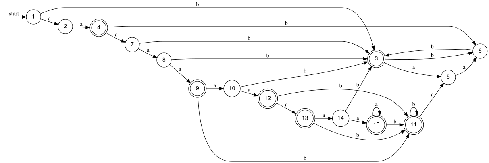
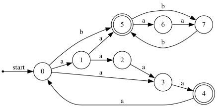
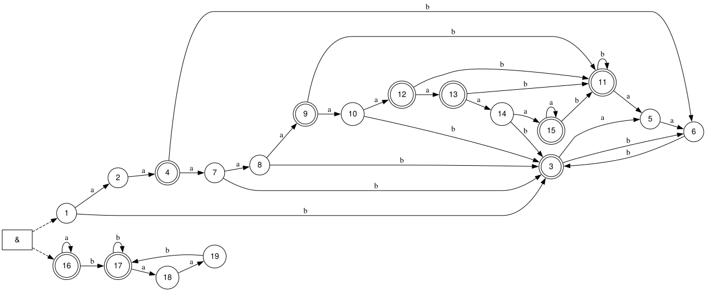

# Вариант 11
```
(aaa|aaaaa)*(aa|b)(bb|aab)*
```

# Минимальный ДКА:

## Таблица ДКА:
|State| a | b | aa | aaa | aab | aaaa | bb |
|-----|---|---|----|-----|-----|------|----|
| 1   | -  | +  | +   |   -  |  -   |    -  |  -  |
| 2   | +  | -  |  -  |  -   |  +   |  +    | -   |
| 3   | -  |  - | -   |  -   |  +   |  -    |   + |
| 4   | -  |  - |  -  |  +   |   +  |   -   | +   |
| 5   | -  | -  |  -  |   -  | -    |  -    | -   |
| 6   | -  |  + | -   | -    |  -   |   -   |  -  |
| 7   | -  | +  | +   |   -  |  +   |    +  | -   |
| 8   | +  | +  |  -  |  +   |  +   |  +    |  -  |
| 9   | -  | +  |  +  |  +   | +    |   -   | +   |
|10   |  + | +  | +   |  -   |  +   |   +   | -   |
|11   | -  | +  |  -  |  -   |  +   |   -   |  +  |
|12   |  + | +  |   - |  +   |  +   |   +   |   + |
|13   | -  | +  | +   | +    |  +   |   +   |  +  |
|14   |  + |  + |   + |  +   |   +  |   +   |  -  |
|15   |  + |  + |  +  |  +   |  +   |  +    |   + |


# НКА:


## Таблица НКА:
| State | $a^2$ | $\varepsilon$ | $ab$ | $b$ | $a$ |      
|-------|-------|-------|-------|-------|-----|
| {0}($\varepsilon$)     | +     | -     | -     | +     | -   | 
| {5}(b)     | -     | +     | -     | -     | -   |
| {6}(ba)     | -     | -     | +     | -     | -   |
| {7}(bb)     | -     | -     | -     | +     | -   |
| {1, 3}(a)     | -     | -     | -     | -     | +   | 


То есть в НКА как минимум 5 состояний.

# Расширенное регулярное выражение:

`^(?!(a|aa|aaaa|aaaaaaa)(?=(aa|b)))a*(aa|b)((bb)+|(aab)+)?$`

Строится исходя из соображения, что 
`(aaa|aaaaa)*` = $a^n$ `\ {a, aa, aaaa, aaaaaaa}`

# ПКА:
Во второй ветви проверяется инвариант: все блоки из b разделяются только aa и если в слове есть b, то оно не может закончиться на aa.




## Таблица ПКА:
|State| $a$ | $aa$ | $a^4$ | $b$ | $aaa$ | $aab$ | $bb$ |
|-----|---|---|----|-----|-----|------|----|
| 13   | __-__  | +  | +   |   +  |  +   |    +  |  + |
| 12   | +  | __-__  |  +  |  +   |  +   |  +    | +   |
| 9   | -  |  + | __-__   |  +   |  +   |  +    |   + |
| 4   | -  |  - |  -  |  __-__   |   +  |   +   | +   |
| 3   | -  | -  |  -  |   -  | __-__    |  +    | +   |
| 19   | -  |  - | -  | -    |  -   |   __-__   |  +  |
| 1   | -  | +  | -   |   +  |  +   |    +  | __-__   |
